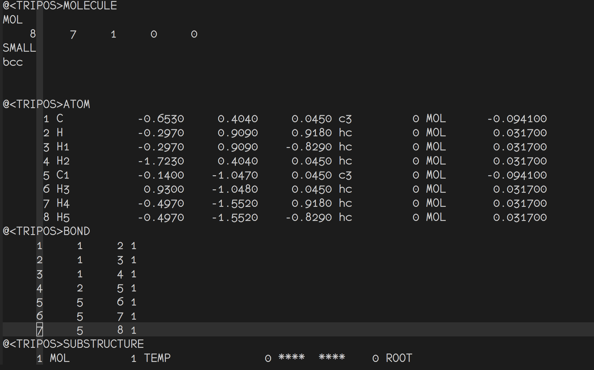
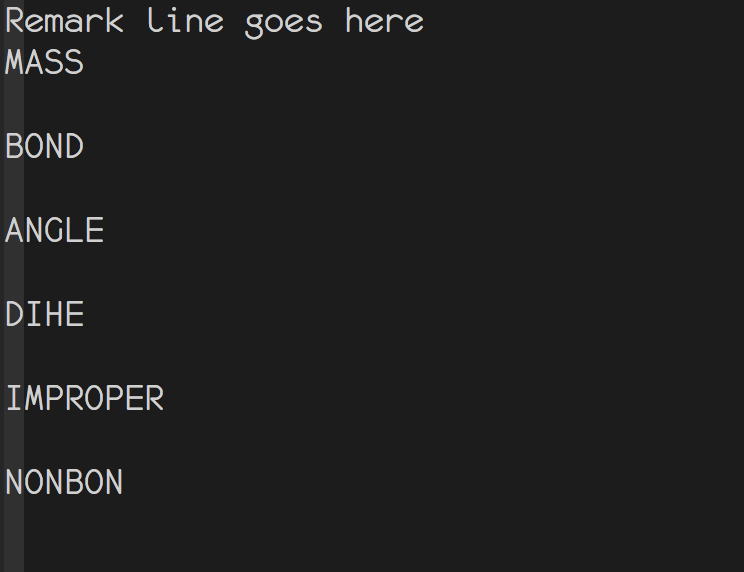
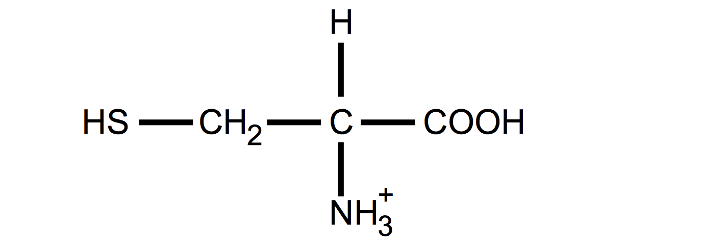
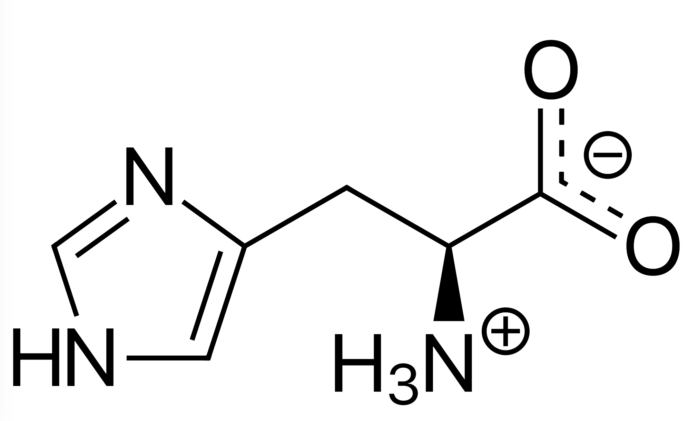
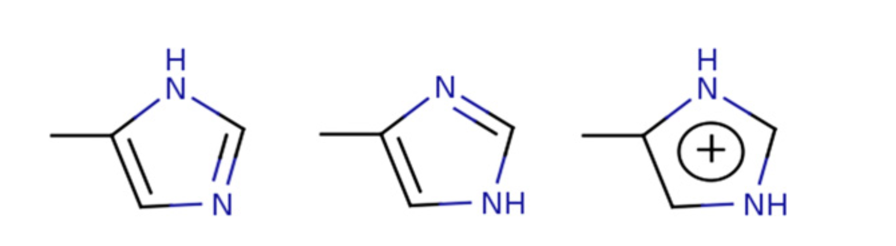

#AMBER QM/MM and BOND MODEL introduction
[toc]

## QM/MM 模拟
### Introduction

- **Antechamber**:与GAFF结合使用，为pdb文件(非标准氨基酸)生成参数文件.如果有参数缺失，需要使用`parmchk2`生成frcmod（froce field modification）模板，帮助生成需要的参数。
- **GAFF**:对于非标准氨基酸，需要用到GAFF力场（genearal AMBER Force field)。  
- **parmchk2**:包含了力场未提供但必要的参数文件，一般的，会根据相似的参数来定义参数，如果存在问题的参数，在frcmod file 中以 <mark>ATTN, need revision</mark>出现，并赋值为0。

GAFF **电荷分配方法** 

1. HF/6-31G* RESP  *keyword resp*
2. AM1-BCC 在较大的体系，比较适用 *keyword bcc*


### 非标准氨基酸
1. 准备pdb文件，用hyperchem 或者Gauss view 建一个小分子，并保存为pdb格式文件。
2. 运行`antechamber -i c2h6.pdb -fi pdb -o c2h6.mol2 -fo mo
l2 -c bcc`忽略中间文件，得到c2h6.mol2 文件  
 

	一般的，所有的GAFF原子类型都以小写字母表示

3. 用parmchk2查看是否所有的参数准备好 `parmchk2 -i c2h6.mol2 -f mol2 -o frcmod`

	
	表示所有的参数都是完整的

4. 对于c2h6分子，所有的参数都是完整的，因此不需要手动添加参数信息
5. 使用tleap生成坐标文件和力场参数文件
	> tleap  
	> source leaprc.gaff  
	> c2h6=loadmol2 c2h6.mol2  
	> check c2h6
	> > Checking 'c2h6'....  
	> > Checking parameters for unit 'c2h6'.  
	> > Checking for bond parameters.  
	> > Checking for angle parameters.  
	> > Unit is OK.  
	
	> saveamberparm c2h6 c2h6.prmtop c2h6.inpcrd
6. 如果需要加水
	> source leaprc.water.tip3p  
	> solvatebox c2h6 TIP3PBOX 12  
	
	12 表示任意原子与水盒边的距离
	
7. <font color=red> ❌对于生成的mol2文件会报错，找不到相应的参数文件
`Could not find vdW (or other) parameters for type: HW`</font>  
	<font color=blue> ✅在使用tleap时应该加入`tleap -s -f leaprc.ff14SB` </font>  
	这时已经添加了TIP3PBOX,(默认已经添加了solvents.lib)不需要使用 `source leaprc.water.tip3p`

### SHAKE 算法
在模拟的体系中，存在着很多重要的约束，比如要约束共价键的键长，二面角等等。采用约束的方法有很多，在分子模拟的体系中，一般以拉氏乘子法来进行约束。  
进行约束时，主要是求解n阶非线性方程组，shake算法主要是通过Gauss-Seidel 进行计算

- ntc=1，不进行约束
- ntc=2 与氢相关的键进行约束
- ntc=3 所有的键进行约束

在进行优化的过程中，一般不使用`SHAKE`，除了可以在进行动力学模拟之前去掉bad contacts.通常和`ntc`一起使用

### QM/MM Introduction 

QM/MM 模拟将原子分为两个部分，QM区域和MM区域，能量被分为三个部分，$H_{QM}$，$H_{QM/MM}$,$E_{MM}$,其中$E_{MM}$利用经典的经验参数进行计算
$H_{QM}$运用量化的方法进行计算。而较为复杂的$H_{QM/MM}$包含了两项，一项是MM区域的点电荷和QM区域的电子相互作用，一种是MM区域的点电荷和QM区域的核相互作用.

另外在一些情况下，需要考虑QM和MM区域存在共价键的情况，AMBER在处理这些时采用了连接原子(`link atoms`),连接原子的处理比较经验和界面比较经验.
而对于含有cutoff的体系，在cutoff内部，QM和MM原子使用全多极矩计算(full multipole treatment),在cutoff外部，为点电荷之间的相互作用。

- PM3/MM 更好地描述了QM-MM界面，`qmmm_int=3` and `qm_theory=PM3`
- `ifqnt=1` 进行qmmm计算
- 计算长程电势时，可以使用Ewald sum 方法来统计电势，关键字`qm_ewald`,但对于大体系计算量较大，使用PME model，关键字为`qm_pme`

如果使用在计算QM-MM相互作用时，使用了QM多极矩，这会使得电势在边界不连续，因此需要使用switching function，关键字为`qmmm_switch`

```    
&qmmm
qmmask=’:753’,! Residue 753 should be treated using QM
qmcharge=-2,! Charge on QM region is -2
qm_theory=’PM3’, ! Use the PM3 semi-empirical Hamiltonian
qmcut=8.0 ! Use 8 angstrom cut off for QM region 
qmshake = 1   ! Shake QM hydrogen atoms (default = 1 if ntc=2)
qmcharge=0 ! The integer charge of the QM region (default = 0)
/
```

## BOND model--MPCB.py
MCPB(Metal Center Parameter Builder) 运用bond和静电模型来生成力场参数。
>  `MCPB -i input_file -s/--step step_number `

`input`文件，包括以下重要的参数

1. **original_pdb** 只准包含一条侧链，包含氢原子和金属原子，一般在处理之前可以使用`H++`和`pdb4amber` 来处理pdb文件
2. **ion_ids** 金属原子在PDB文件中的原子序号，整数
3. **ion_mol2files** 金属原子的mol2file，可以使用`antchamber`来生成单个原子的mol2文件，可以手动修改原子类型和所带电荷
4. **cut_off** 在cutoff以内，金属原子和附近的原子有共价键作用，默认值为2.8A
5. **group_name** 生成各个文件的前缀
6. **gau_version** `g03` 和 `g09` ，默认为`g03`
7. **force_field** 默认的为`ff14SB`

### STEP in MCPB.py
1. 生成不同模型的(sidechain, standard and large models) modeling 文件(PDB, fingerprint 和 Gaussian input files)，其中sidechain模型用来计算`force constants`，**large model**用来计算`RESP charge`
2. 生成frcmod文件，`Seminario method`需要`Gaussian fchk`文件，在生成fchk文件过程中，几何优化和力常数都需要进行。
3. 执行RESP电荷分配，并生成金属离子复合物中心的残基mol2文件（residues within the metal ion complex）
> Restrains the charges of the heavy backbone atoms in the ligating residues

4. 生成leap 输入文件

#### CYS的三种质子化(protonated cysteine)状态
 

Pdb 文件不包含原子成键信息，因此无硫原子的质子化状态信息

- 常规的质子化，命名为**CYS**
- 去质子化状态和金属原子连接，命名为**CYM**
- 形成*disulphide bridges*，命名为**CYX**

#### HIS的三种质子化(protonated cysteine)状态
 
 

- **HID**: Histidine with hydrogen on the delta nitrogen
- **HIE**: Histidine with hydrogen on the epsilon nitrogen
- **HIP**: Histidine with hydrogens on both nitrogens; this is positively charged.


#### EXAMPLE
##### prepare PDB file
******
1. 下载1E67.pdb文件，找到有关metal center 中心的原子信息
2. 取出链A `awk '$1=="ATOM"' 1E67.pdb  | awk '$5=="A"' > 1E67_A.pdb`
3. 生成金属原子的pdb文件`awk '$1=="HETATM"' 1E67.pdb | awk '$3=="ZN"' | awk '$5=="A"' > Zn.pdb`
4. 如果存在着配体，还要取出相应的配体文件
5. 利用H++网站，自动加氢，并生成相应的topology结构和坐标文件，此时非标准氨基酸和金属离子都被剔除掉。
6. `ambpdb -c ***.inpcrd -p ***.prmtop > ***.pdb`
5. 由于CYS和金属离子有成键信息，因此需要把CYS的`HG`去掉，并重新命名为`CYM`
6. 将HIP改为HIE(117)，并把原子`HD1`去掉(这里的HIP和CYS都是在METAL center中的原子)，
最终生成需要的pdb文件`1E67_fixed_H.pdb`
7. 利用**antechamber**生成金属离子的**mol2**文件
`antechamber -fi pdb -fo mol2 -i ZN.pdb -o ZN_pre.mol2 -at amber -pf y`
将生成的**ZN_pre.mol2**文件原子类型改为`ZN`，电荷为2,保存为**ZN.mol2**文件
	
	>  		1 ZN          12.3770    52.3150    31.7210 ZN       129 ZN        2.000000
8. 将生成的`***.pdb` 和`Zn.pdb`文件合并在一起 `cat ***.pdb Zn.pdb > 1E67_H.pdb`
9. 利用`pdb4amber`，重新将原子排序`pdb4amber -i 1E67_H.pdb -o 1E67_H_renum.pdb`

##### MCPB运行
*******
1. `MCPB.py -i 1E67.in -s 1` 1E67.in文件如下

	```
original_pdb 1E67_fixed_H.pdb   
group_name 1E67  
cut_off 2.7  
ion_ids 1931  
ion_mol2files ZN.mol2  
software_version g09  
```
2.  Run g09  
`g09 < 1E67_small_opt.com > 1E67_small_opt.log`
`g09 < 1E67_small_fc.com > 1E67_small_fc.log`
`formchk 1E67_small_opt.chk 1E67_small_opt.fchk`
`g09 < 1E67_large_mk.com > 1E67_large_mk.log`

2. `MCPB.py -i 4ZF6.in -s 2`
3. `MCPB.py -i 4ZF6.in -s 3`
4. `MCPB.py -i 4ZF6.in -s 4`
5. `tleap -s -f 4ZF6_tleap.in > 4ZF6_tleap.out`
	最终生成了我们需要的`1E67_solv.prmtop,1E67_solv.inpcrd`
6. NEXT do the simulation!!


### PdbSearcher.py

	 Usage: -i/--ion ionname -l/--list input_file  
  			-e/--env environment_file -s/--sum summary_file  
			[-c/--cut cutoff]
1. -i 离子的名称，比如**Zn**
2. -l 包含pdb文件名称的文件，每一行包含一个pdb文件名称 主义这里的pdb文件是未受处理的原始的pdb文件
3. -e 生成金属离子相关环境的文件，包括结合原子，距离和几何信息
4. -s 生成summary 文件，包含几何信息，结合残基等等信息

- **example** `PdbSearcher.py -i Zn -l 1E67.list -e 1E67.env -s 1E67.sumf`


